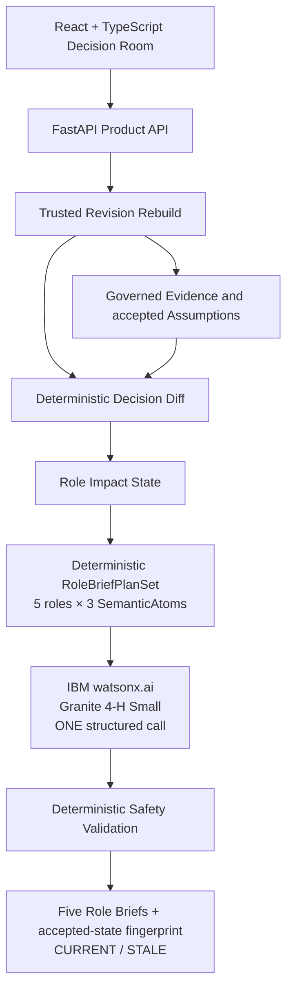

# RoleLens

**Know what must change when the decision changes.**

Teams often keep using analysis, recommendations, and AI outputs after the assumptions behind a business decision have changed. RoleLens propagates accepted decision revisions across governed role views, shows what changed and what still holds, and marks earlier AI interpretations stale until they are refreshed against the new trusted state.

## Competition Submission

**August 2026 Submission — Wildcard Challenge: Build Intelligent Systems for the Future of Work**

RoleLens is a solo submission to the IBM AI Builders Challenge — August 2026.

## The Problem: Decision State Drift

A business decision can outlive the assumptions that originally supported it. Analysis, role recommendations, AI interpretations, and cross-functional next steps can remain visually credible even after the accepted decision state has changed.

RoleLens addresses this decision state drift. It gives cross-functional teams an AI-supported coordination surface that stays tied to the current accepted state—showing what must be reconsidered without rewriting the observed Evidence that still holds. Making revision impact visible before teams reuse stale work is designed to reduce avoidable rework and clarify what needs to be reconsidered across functions. That is the Future of Work opportunity: using AI to communicate governed decisions clearly while keeping human acceptance and deterministic controls authoritative.

## Who It Is For

RoleLens is for a Business Analyst, Strategy & Operations professional, or other cross-functional decision owner coordinating a business decision across functions. The user needs to understand which assumptions changed, which functions are affected, and what governed review follows.

The five user-visible role lenses are:

- Executive
- Data Analyst
- Data Engineer
- Sales / Marketing
- Project Manager

They are governed functional views over shared Evidence, Assumptions, and decision state—not independent decision-makers.

## What RoleLens Does

1. **Ground the Decision.** Governed observed Evidence is kept separate from explicit, human-authored accepted Assumptions.
2. **Edit a scenario assumption.** The edit remains a DRAFT and is marked UNSAVED. It cannot mutate trusted role state.
3. **Accept through Recalculate.** RoleLens deterministically recalculates modeled scenario impact and propagates which role views changed, remained unchanged, or became blocked.
4. **Generate governed interpretation.** IBM Granite expresses a deterministic semantic plan in role-readable language. An accepted revision automatically makes an older AI brief STALE until the user explicitly refreshes it.

Only an accepted recalculation changes the trusted Decision state. Typing into a draft field does not.

## Signature Demo: 3% → 7%

The demo models a customer-retention pilot with these RoleLens-authored scenario assumptions:

- Pilot population: 500
- Cost per intervention: 30 USD
- Retained customer value: 500 USD

### Accepted 3% lift

- Modeled net scenario value: **−7,500 USD**
- The scenario **DOES NOT CLEAR** modeled break-even.
- Sales / Marketing is **BLOCKED** from pilot review.
- A Granite role brief generated for this accepted state is **CURRENT**.

### Edit lift to 7% without recalculating

- The draft is **UNSAVED**.
- The trusted Decision remains at 3%.
- Deterministic role state remains unchanged.
- The existing 3% Granite brief remains **CURRENT**.

### Accept 7% through Recalculate

- Modeled net scenario value: **+2,500 USD**
- The scenario **CLEARS** modeled break-even.
- Sales / Marketing becomes eligible for pilot review.
- The previously generated 3% Granite brief automatically becomes **STALE**.

Selecting **Refresh Role Brief** regenerates the interpretation against the governed 7% state and returns the lifecycle to **CURRENT**.

These are modeled scenario economics, not observed ROI. USD belongs to the RoleLens-authored scenario, not the public dataset. Clearing modeled break-even is not approval: eligibility for pilot review does not authorize execution, customer outreach, or customer targeting.

## Why This Is Different From a Chatbot

| Generic AI assistant | RoleLens |
|---|---|
| Question → generated answer | Accepted Decision → governed propagation |
| Free-form context | Observed Evidence separated from human-authored Assumptions |
| Model may infer workflow or posture | Role impact and scenario posture are calculated deterministically |
| An old answer can remain visually plausible | Accepted revision makes the old AI brief STALE |
| Model may select what matters | RoleLens constructs governed SemanticAtoms before Granite |
| Model-generated next steps | Deterministic, role-bounded handoff |

## AI Approach

RoleLens uses this bounded pipeline:

```text
Trusted Decision
→ deterministic Decision Diff
→ deterministic RoleBriefPlanSet
→ 15 governed SemanticAtoms
→ ONE IBM Granite 4-H Small call
→ bounded role-readable language realization
→ deterministic safety validation
→ five Role Impact Briefs
```

**RoleLens determines the trusted scenario state and the governed meaning available to each role; IBM Granite expresses that meaning in clear, role-readable language.**

Granite does not calculate the scenario economics, decide whether the scenario clears break-even, assign role posture, select Evidence or Assumptions, choose handoffs, approve work, or grant execution authority. One structured chat call returns the language realization for all five briefs.

## Architecture



- **Frontend:** React, TypeScript, Vite, Tailwind CSS, and React Flow
- **Backend:** FastAPI and deterministic Python domain logic
- **Demo runtime:** Stateless backend; no database is required for the current competition product

## Trust and Safety by Design

- **Evidence ≠ Assumption.** Observed dataset findings stay separate from human-authored future assumptions.
- **Draft ≠ Accepted Decision.** Unsaved edits cannot change trusted scenario or role state.
- **Deterministic economics.** Decimal-based scenario logic—not Granite—computes modeled values and break-even status.
- **Accepted-state fingerprint.** AI brief lifecycle is tied to the exact trusted accepted Decision state.
- **Governed semantic source binding.** `RoleBriefPlanSet` creates exactly 15 SemanticAtoms: five roles × three narrative sections. Each deterministic atom ID binds returned text to the governed semantic source assigned to that section; it is not formal proof of semantic equivalence.
- **Deterministic governance outputs.** Evidence references, assumption references, and handoffs are reconstructed by RoleLens. Granite does not choose them.
- **Fail closed.** Malformed or policy-invalid Granite output is rejected rather than silently rendered.
- **CLEARS ≠ APPROVED.** Clearing modeled break-even establishes eligibility for pilot review only—not approval, authorization, or execution permission.

## IBM Technology

RoleLens uses **IBM watsonx.ai** with **`ibm/granite-4-h-small`** for bounded language realization over deterministic semantic plans. A request-scoped JSON schema constrains one structured-output chat call that returns all five role briefs in one response.

Granite generation occurs only after the user explicitly selects **Generate Role Brief** or **Refresh Role Brief**. It does not run in the background. Live generation requires configured watsonx.ai credentials, and latency may vary.

## How IBM Bob Was Used

IBM Bob served as the primary development assistant throughout RoleLens. It supported planning, architecture, implementation, testing, debugging, refactoring, and documentation. Bob outputs were reviewed before acceptance, and significant proposals were corrected or narrowed through explicit human decisions.

Logged corrections include tightening evidence identity and provenance boundaries, separating source scope from Evidence scope, narrowing AI authority, and applying test-driven implementation fixes. Human review remained authoritative. IBM Bob was the development tool; IBM Granite on watsonx.ai is the runtime AI.

See the [IBM Bob Usage Log](07_IBM_BOB_USAGE_LOG.md) and [Bob Build Log](docs/bob_build_log.md).

## Live Validation Evidence

A small predefined live IBM Granite integration gate was run after the governed-semantic-plan refactor:

- Accepted 3% scenario → HTTP 200
- The same accepted 3% scenario again → HTTP 200
- Accepted 7% scenario → HTTP 200

The repeated 3% call checked that the same accepted state could complete the predefined governed integration path twice before the revised 7% state was tested. This was a bounded integration gate, not a benchmark, load test, or statistical reliability claim.

The lifecycle was also manually verified: **3% CURRENT → unsaved 7% remains CURRENT → accepted 7% makes the old brief STALE → Refresh returns CURRENT**.

## Demo Data and Provenance

The public IBM-hosted Telco Customer Churn sample is used as observed business Evidence. RoleLens separately adds the modeled retention-pilot assumptions used in the signature demo. IBM did not supply those retention economics, and the source dataset does not establish USD currency.

RoleLens does not use the dataset to claim causal effects, predict churn, or select customers for outreach. Dataset origin, licensing, byte-level provenance, and RoleLens-authored context boundaries are documented in the [public demo-data README](sample_data/public/README.md) and [Third-Party Notices](THIRD_PARTY_NOTICES.md).

## Quickstart

Prerequisites:

- Python 3.13 (tested with Python 3.13.5)
- Node.js 20.19+ or 22.12+

Start the backend from the repository root:

```bash
python -m venv .venv
# Windows: .\.venv\Scripts\activate
# macOS/Linux: source .venv/bin/activate
python -m pip install -r requirements.txt
python -m uvicorn app.product_api:app --reload --port 8000
```

In a second terminal, start the frontend:

```bash
cd frontend
npm ci
npm run dev
```

Open `http://localhost:5173`. Vite proxies `/api` requests to `http://127.0.0.1:8000`.

The deterministic Decision Room remains usable without watsonx.ai credentials. Only explicit live Granite **Generate** or **Refresh** requires runtime configuration:

```text
WATSONX_URL
WATSONX_APIKEY
WATSONX_PROJECT_ID
WATSONX_MODEL_ID
```

`WATSONX_MODEL_ID` is optional and defaults to `ibm/granite-4-h-small`. Keep credentials in runtime environment configuration; never commit them.

## Verification

```bash
pytest
cd frontend
npm run test -- --run
npm run build
```

## Limitations

The current competition scope is intentionally bounded:

- One competition demo Decision
- Browser-session revision history and a stateless backend
- No persistent enterprise Decision store
- No execution authorization
- No automatic customer outreach or targeting
- No predictive churn model or causal inference
- Granite latency varies, and live generation requires watsonx.ai credentials
- Atom IDs provide semantic source binding, not formal proof of semantic equivalence
- This competition prototype is not a production approval system

## Team

- **Zhe Wang (Victor)**
- Solo participant
- University of Dayton
- **Competition:** IBM AI Builders Challenge — August 2026
- **Theme:** Wildcard Challenge — Build Intelligent Systems for the Future of Work
