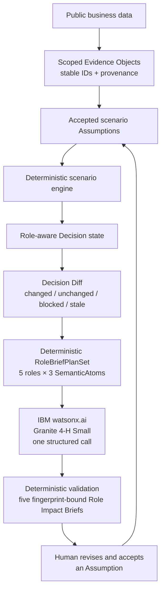

# RoleLens

**Know what must change when the decision changes.**

RoleLens is a role-aware, evidence-controlled decision change workspace. It shows how an accepted change to a business assumption recomputes the modeled decision, propagates impact across governed role views, and makes an earlier AI interpretation visibly stale until it is refreshed against the new accepted state.

## Selected Challenge Theme

**IBM AI Builders Challenge with IBM Bob — August 2026**

**Wildcard Challenge — Build Intelligent Systems for the Future of Work**

RoleLens is a solo submission by Zhe Wang.

## Problem

Data, assumptions, and AI recommendations change at different times. A recommendation that was reasonable under one accepted assumption can become invalid after that assumption changes—even while the underlying observed Evidence remains valid.

Teams can therefore keep acting on stale role guidance, AI interpretations, or next steps created for an older decision state. Making revision impact visible before stale work is reused is designed to reduce avoidable rework and clarify what must be reconsidered across functions.

## Solution

RoleLens gives a Business Analyst, Strategy & Operations professional, or cross-functional decision owner one controlled path for revising a decision:

1. Ground the Decision in governed Evidence and explicit accepted Assumptions.
2. Let a human edit a real scenario assumption as an UNSAVED draft.
3. Accept the edit through deterministic Recalculate logic.
4. Show the Decision Diff: what recomputed, what stayed unchanged, and which role views became changed, blocked, or recomputed.
5. Mark any Granite brief tied to the prior accepted-state fingerprint as STALE.
6. Regenerate five role-readable briefs from the newly accepted governed state.

Draft edits do not mutate the trusted Decision. Only an accepted recalculation changes the accepted state, and the human retains final decision authority.

The five user-visible role lenses are Executive, Data Analyst / Data Scientist, Data Engineer, Sales / Marketing, and Project Manager. They are governed views over shared Evidence and accepted state—not independent agents.

## Why RoleLens Is Different

| Generic LLM or CSV assistant | RoleLens |
|---|---|
| Rewrites an answer after context changes | Rebuilds an accepted Decision and propagates dependency-aware impact |
| Treats supplied context as one prompt | Separates observed Evidence, external context, stated priorities, and Assumptions |
| May infer scenario math or workflow | Computes scenario arithmetic and role posture deterministically |
| Leaves an older answer visually plausible | Marks a prior fingerprint-bound AI brief STALE |
| Selects its own grounding or next step | Receives governed SemanticAtoms; refs and handoffs are reconstructed by RoleLens |

The central differentiator is not a better rewrite. It is an explicit record of why a decision changed, which downstream outputs depend on that change, and which earlier outputs can no longer be treated as current.

## Demo Scenario

The evaluator demo uses the public IBM-hosted Telco Customer Churn sample as observed business Evidence. RoleLens adds separate scenario context and modeled retention-pilot assumptions; these are demo metadata, not observed facts from the dataset.

The modeled pilot uses:

- Pilot population: 500
- Cost per intervention: 30 USD
- Retained customer value: 500 USD

### Accepted 3% lift

- Modeled net scenario value: **−7,500 USD**
- The scenario **DOES NOT CLEAR** modeled break-even.
- Sales / Marketing is **BLOCKED** from pilot review.
- A Granite brief generated for this accepted state is **CURRENT**.

### Draft 7% lift without recalculating

- The edit is **UNSAVED**.
- The accepted Decision remains at 3%.
- Evidence and deterministic role state remain unchanged.
- The existing 3% Granite brief remains **CURRENT**.

### Accept 7% through Recalculate

- Modeled net scenario value becomes **+2,500 USD**.
- The scenario **CLEARS** modeled break-even.
- Sales / Marketing becomes eligible for pilot review.
- Dependent role impacts change while the observed Evidence remains unchanged.
- The previous 3% Granite brief becomes **STALE**.

Selecting **Refresh Role Brief** realizes a new governed plan for the accepted 7% state and returns the brief lifecycle to **CURRENT**.

These values are modeled what-if economics, not observed ROI. USD is a RoleLens-authored scenario assumption, not a property of the dataset. Clearing break-even means eligibility for pilot review—not approval, execution authority, outreach permission, or customer-targeting permission. The demo performs no individual customer targeting.

## Core Workflow



## Architecture

- **Frontend:** React, TypeScript, Vite, Tailwind CSS, and React Flow
- **Backend:** FastAPI, Python, Pydantic, and pandas
- **Runtime AI:** IBM Granite through watsonx.ai
- **Control layer:** deterministic source/evidence identity, exact provenance, role policy, Decimal scenario calculation, Decision Diff propagation, semantic safeguards, and accepted-state fingerprint lifecycle
- **Demo state:** stateless backend with browser-session revision history; no database is required

The final evaluator experience is the React Decision Room. Earlier repository modules remain useful implementation history, but the current Hero is accepted scenario revision and Decision Diff—not a memo-centered workflow.

## Deterministic vs AI Responsibilities

| Deterministic RoleLens controls | IBM Granite | Human |
|---|---|---|
| Source and Evidence identity, data profiling, scenario arithmetic, accepted-state transitions, dependency propagation, role posture, refs, handoffs, and CURRENT/STALE detection | Bounded role-readable realization of a deterministic semantic plan; probabilistic semantic-risk review where used | Supplies and revises Assumptions, accepts recalculation, reviews output, and retains final decision authority |

RoleLens determines the trusted scenario state and the governed meaning available to each role; IBM Granite expresses that meaning in clear, role-readable language.

Granite does not calculate the financial scenario, decide whether it clears break-even, select Evidence or Assumptions, assign role posture, choose a handoff, approve work, or authorize execution.

## Evidence and Trust Design

- **No evidence ID, no evidence-backed decision claim.** `source_id` identifies an input source; `evidence_id` identifies a governed Evidence Object.
- **Exact provenance.** Source locators preserve the relevant sheet, field, row range, or text span rather than citing a source only at file level.
- **Epistemic separation.** Internal observations, external context, user Assumptions, stated priorities, and decision-only context have distinct scopes. External context is not company-specific proof, and Assumptions are not observed facts.
- **Role policy.** `config/role_policy.json` constrains the five role views over shared Evidence.
- **Deterministic economics.** Decimal-based logic computes modeled values and state transitions; Granite does not invent the math.
- **Governed semantic source binding.** `RoleBriefPlanSet` creates exactly 15 SemanticAtoms. Deterministic atom IDs bind each returned section to its assigned semantic source, but do not prove formal semantic equivalence.
- **Deterministic governance outputs.** Evidence refs, Assumption refs, and handoffs are reconstructed by RoleLens rather than selected by Granite.
- **Fail closed.** Malformed or policy-invalid provider output is rejected instead of silently rendered.
- **Human authority.** Probabilistic semantic review is non-authoritative, and a scenario clearing break-even is not approval.

## IBM Technology

RoleLens uses **IBM watsonx.ai** with **`ibm/granite-4-h-small`**. One explicit **Generate Role Brief** or **Refresh Role Brief** action sends a deterministic semantic plan through a request-scoped structured-output schema and returns all five brief realizations in one chat response.

Granite does not run in the background. Live generation requires configured watsonx.ai credentials, and latency may vary.

## Evaluation

RoleLens reports the frozen semantic-review evidence without treating a small fixture pack as general reliability proof:

- **Calibration regression:** 8/8 strict passes, required detection recall 1.0, and zero false-positive scenarios. This is a calibration regression, not an independent benchmark; its scenarios informed prompt calibration.
- **Frozen one-time holdout:** 5/8 strict passes, required detection recall 0.5, and zero evaluated false-positive scenarios. False negatives remained for unseen causation, role-boundary, and citation-mismatch wording.

These results show why the semantic reviewer remains probabilistic and non-authoritative. Human review remains required. The packs do not establish production reliability.

See the [evaluation protocol](docs/evaluation.md), [reviewed calibration regression](docs/evaluation_runs/2026-07-27_granite-4-h-small_calibration-v2-review.md), and [reviewed frozen holdout](docs/evaluation_runs/2026-07-27_granite-4-h-small_holdout-v1-review.md).

## How IBM Bob Was Used

IBM Bob was the primary development tool for RoleLens's foundational build and first complete working prototype in July 2026. It supported the architecture, Evidence identity and provenance system, deterministic data processing and Evidence generation, governed role engine and role-policy enforcement, IBM Granite integration, deterministic and semantic risk controls, evaluation infrastructure, workflow planning, human-review and Decision Memo flow, testing, debugging, and the original end-to-end Streamlit prototype.

In August, development shifted primarily to Codex for the deterministic scenario redesign, Decision Diff, React/FastAPI Decision Room, trusted impact propagation, final product UX, and governed Role Impact Brief integration. That work retained and extended the Bob-built Evidence, provenance, role-policy, Granite, risk, workflow, and evaluation foundations. Human review remained authoritative throughout; IBM Granite on watsonx.ai is the runtime AI.

See the [IBM Bob Usage Log](07_IBM_BOB_USAGE_LOG.md) and [Bob Build Log](docs/bob_build_log.md).

## Public Demo Data

The IBM-hosted sample CSV is redistributed under its upstream Apache License 2.0 terms and is byte-identical to the pinned upstream file. The RoleLens-authored context and scenario metadata are separate from the upstream dataset.

See the [public demo-data provenance](sample_data/public/README.md) and [Third-Party Notices](THIRD_PARTY_NOTICES.md).

## Quickstart

Prerequisites:

- Python 3.13 (tested with Python 3.13.5)
- Node.js 20.19+ or 22.12+

Start the backend from the repository root:

```bash
python -m venv .venv
# Windows: .\.venv\Scripts\activate
# macOS/Linux: source .venv/bin/activate
python -m pip install -r requirements.txt
python -m uvicorn app.product_api:app --reload --port 8000
```

In a second terminal, start the frontend:

```bash
cd frontend
npm ci
npm run dev
```

Open `http://localhost:5173`. Vite proxies `/api` requests to `http://127.0.0.1:8000`.

The deterministic Decision Room works without watsonx.ai credentials. Explicit live Granite **Generate** or **Refresh** requires runtime configuration:

```text
WATSONX_URL
WATSONX_APIKEY
WATSONX_PROJECT_ID
WATSONX_MODEL_ID
```

`WATSONX_MODEL_ID` is optional and defaults to `ibm/granite-4-h-small`. Keep credentials in runtime environment configuration; never commit them.

## Verification

```bash
pytest
cd frontend
npm run test -- --run
npm run build
```

No automated-test total is frozen here; final counts belong to the final fresh-clone verification record.

## Limitations

RoleLens is an intentionally bounded competition prototype / proof of concept:

- One competition demo Decision using public sample data, not production company data
- Financial scenario fields are user-supplied what-if Assumptions
- Browser-session revision history and a stateless backend
- No persistent enterprise Decision store, real approval permissions, or execution authorization
- No production customer targeting, automatic outreach, predictive churn model, or causal inference
- Probabilistic semantic review can miss unsupported wording and remains non-authoritative
- Live Granite requires watsonx.ai credentials, and latency varies
- Atom IDs provide semantic source binding, not formal proof of semantic equivalence
- Small evaluation packs do not establish general or production reliability

## Repository Guide

- [`app/`](app/) — FastAPI product API and deterministic/AI control layers
- [`frontend/`](frontend/) — React Decision Room
- [`tests/`](tests/) — backend contract and product tests
- [`docs/evaluation.md`](docs/evaluation.md) — semantic evaluation protocol
- [`docs/evaluation_runs/`](docs/evaluation_runs/) — frozen raw and human-reviewed runs
- [`docs/bob_build_log.md`](docs/bob_build_log.md) — public IBM Bob evidence log
- [`sample_data/public/`](sample_data/public/) — licensed demo data and provenance

## Team

- **Zhe Wang**
- Solo participant
- University of Dayton
- M.S. Business Analytics

## Demo Video

[Watch the 2:57 RoleLens demo on YouTube](https://youtu.be/KMsBTl9cB4Q)
